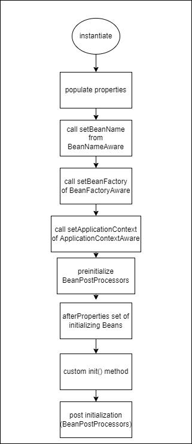

# SpringBeanLifeCycle
these repos for learning spring Bean life cycle

* this diagram show Bean life cycle



* add this tag to spring.xml to be sure that All components is added to ApplicationContext

```xml
<context:component-scan base-package="org.example">
    
</context:component-scan>
```

* output after executing the program
```text
postProcessBeforeInitialization
postProcessAfterInitialization
Customer firstname constructor arguments tawfeek
set first name ..toto
setBeanName customer
setBeanFactorytrue
setApplicationContext false
postProcessBeforeInitialization
initializing bean afterPropertiesSet 
postProcessAfterInitialization
first name toto

```

* in destruction `@Scope("prototype")`
 not keep a reference  it's not destroyed if it's prototype
* in destruction `@Scope("singleton")`
 if it's singleton spring container will destroy it because he will have the singleton reference;
